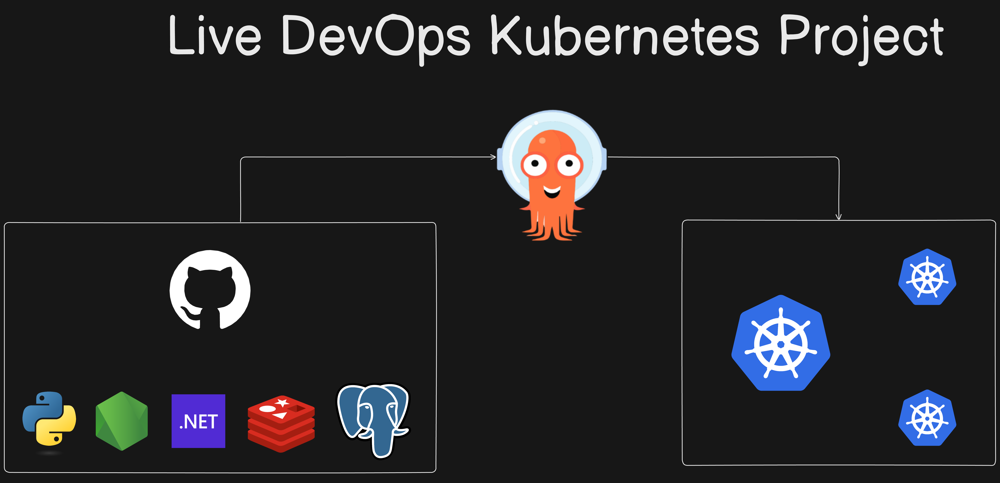
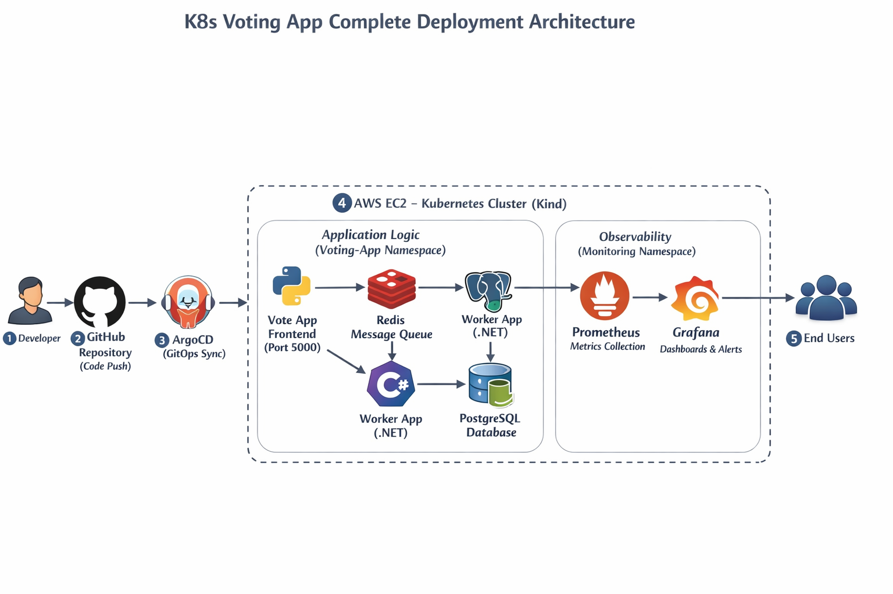
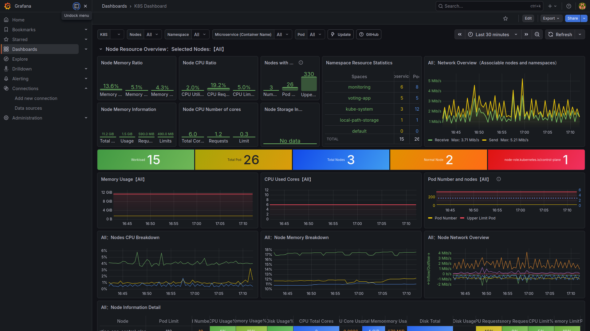
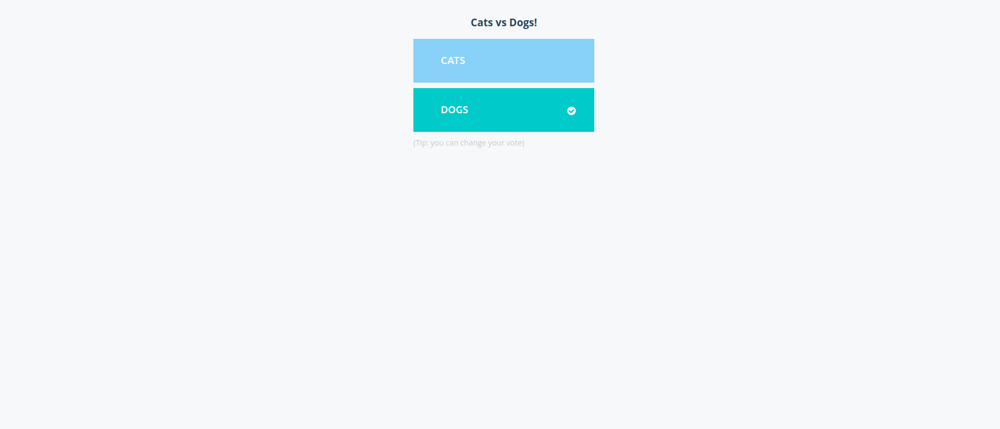
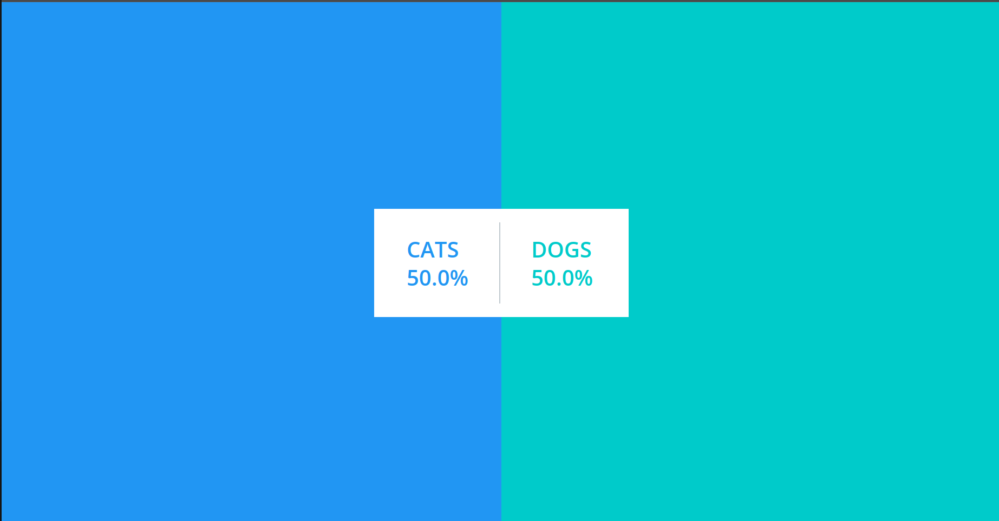

# K8s Kind Voting App

A comprehensive, scalable 5-tier microservices application demonstrating how to deploy, manage, and monitor applications in Kubernetes. This repository is a real-world guide starting from raw containerization to GitOps automation and full-stack observability on an AWS EC2 instance.



## 🌟 Architecture Overview



The application is a distributed voting system (cats vs. dogs) demonstrating asynchronous microservice communication:
1. **Vote App (Python):** Front-end web app that accepts user votes (Port **5000**).
2. **Redis Queue:** In-memory queue that temporarily collects incoming votes to prevent dropped data during heavy traffic.
3. **Worker (.NET):** A background service that watches Redis, consumes votes, and commits them to the database.
4. **Postgres Database:** A persistent relational database to safely store the final vote tally.
5. **Result App (Node.js):** A front-end web app that reads the Postgres database and streams real-time updates to the browser using WebSockets (Port **5001**).

---

## 🧰 Key Technologies

* **Cloud & Infrastructure:** AWS EC2
* **Containerization:** Docker, Docker Compose
* **Container Orchestration:** Kubernetes, Kind (Kubernetes in Docker)
* **GitOps & Delivery:** Argo CD
* **Observability:** Helm, Prometheus, Grafana
* **Application Stack:** Python, Node.js, .NET, Redis, PostgreSQL

---

## 🛠️ Phase 1: Environment Setup 

### 1. Clone the Repository
```bash
git clone https://github.com/DomeshwarThengari/k8s-kind-voteing-app.git
cd k8s-kind-voting-app
```

### 2. Install Kind & Kubectl
If your server (or EC2) does not have Kubernetes tools installed, you can use the provided bash scripts to install them securely:
```bash
# Install Kind
chmod +x kind-cluster/install_kind.sh
./kind-cluster/install_kind.sh

# Install Kubectl
chmod +x kind-cluster/install_kubectl.sh
./kind-cluster/install_kubectl.sh
```

### 3. Setup Secure Environment Variables
Create a hidden `.env` file to hold database passwords securely. This ensures no hardcoded credentials are pushed to GitHub.
```bash
nano .env
```
Paste the following:
```env
POSTGRES_USER=postgres
POSTGRES_PASSWORD=postgres
POSTGRES_DB=postgres
```

---

## 🐳 Phase 2: Local Docker Compose (Optional)
Before moving to Kubernetes, you can test the application natively via Docker Compose. The `docker-compose.yml` file is configured to respect your `.env` variables.

```bash
docker-compose up --build -d
```
Access the application at `http://localhost:5000` (Vote) and `http://localhost:5001` (Results).

---

## ☸️ Phase 3: Kubernetes Deployment via Kind

### 1. Initialize the Cluster
Create a 3-node Kubernetes cluster using the provided configuration file:
```bash
kind create cluster --config kind-cluster/config.yml --name voting-app
```
*Verify it is running: `kubectl get nodes`*

### 2. Deploy Dependencies & Secrets
Inject your `.env` configuration securely into the cluster so the Postgres container can access it:
```bash
kubectl create namespace voting-app
kubectl create secret generic postgres-secret --from-env-file=.env -n voting-app
```

### 3. Apply the Manifests
Deploy all application deployments and services to the cluster:
```bash
kubectl apply -f k8s/
```
*Verify pods are spinning up: `kubectl get pods -n voting-app`*

### 4. Access the Application
Since the Kind nodes run inside isolated Docker containers, you must port-forward traffic from your host machine (or EC2 IP) to the pods:

Open two separate terminal windows (and ensure ports 5000/5001 are allowed in your AWS Security Group):
```bash
# Terminal 1 - Exposing Vote frontend
kubectl port-forward service/vote 5000:5000 -n voting-app --address=0.0.0.0 &

# Terminal 2 - Exposing Result frontend
kubectl port-forward service/result 5001:5001 -n voting-app --address=0.0.0.0 &
```

---

## 🔄 Phase 4: GitOps using Argo CD

Instead of manually deploying via `kubectl apply`, you can automate deployments tracking your Git repository using **Argo CD**.

### 1. Install Argo CD
```bash
kubectl create namespace argocd
kubectl apply -n argocd -f https://raw.githubusercontent.com/argoproj/argo-cd/stable/manifests/install.yaml
```

### 2. Expose the Argo CD UI
Patch the service to use NodePort, and then port-forward so you can view the dashboard:
```bash
kubectl patch svc argocd-server -n argocd -p '{"spec": {"type": "NodePort"}}'
kubectl port-forward -n argocd service/argocd-server 8443:443 --address=0.0.0.0 &
```

### 3. Get Initial Admin Password
To log into the Argo CD web interface:
* **Username:** `admin`
* **Password:** Retrieve it using the following command:
```bash
kubectl get secret -n argocd argocd-initial-admin-secret -o jsonpath="{.data.password}" | base64 -d && echo
```

---

## 📊 Phase 5: Observability (Prometheus & Grafana)

To monitor the performance, CPU, and memory of our cluster, we deploy the famous **Kube Prometheus Stack**.

### 1. Install HELM
```bash
curl -fsSL -o get_helm.sh https://raw.githubusercontent.com/helm/helm/main/scripts/get-helm-3
chmod +x get_helm.sh
./get_helm.sh
```

### 2. Deploy the Prometheus Stack
```bash
helm repo add prometheus-community https://prometheus-community.github.io/helm-charts
helm repo update

kubectl create namespace monitoring

helm install kind-prometheus prometheus-community/kube-prometheus-stack --namespace monitoring \
  --set prometheus.service.nodePort=30000 --set prometheus.service.type=NodePort \
  --set grafana.service.nodePort=31000 --set grafana.service.type=NodePort \
  --set alertmanager.service.nodePort=32000 --set alertmanager.service.type=NodePort \
  --set prometheus-node-exporter.service.nodePort=32001 --set prometheus-node-exporter.service.type=NodePort
```

### 3. Access Dashboards
Port-forward Prometheus (9090) and Grafana (31000):
```bash
kubectl port-forward svc/kind-prometheus-kube-prome-prometheus -n monitoring 9090:9090 --address=0.0.0.0 &
kubectl port-forward svc/kind-prometheus-grafana -n monitoring 31000:80 --address=0.0.0.0 &
```



### 4. Useful PromQL Queries
Test these in your Prometheus query browser:
* **CPU Usage (%):** `sum (rate (container_cpu_usage_seconds_total{namespace="default"}[1m])) / sum (machine_cpu_cores) * 100`
* **Memory Usage by Pod:** `sum (container_memory_usage_bytes{namespace="default"}) by (pod)`
* **Network Receive Bytes:** `sum(rate(container_network_receive_bytes_total{namespace="default"}[5m])) by (pod)`
* **Network Transmit Bytes:** `sum(rate(container_network_transmit_bytes_total{namespace="default"}[5m])) by (pod)`

---

## 📚 Project Snapshots

### The Vote App


### The Result App


---

## 🧹 Cleanup
To completely delete your cluster and free up system resources:
```bash
kind delete cluster --name=voting-app
```
